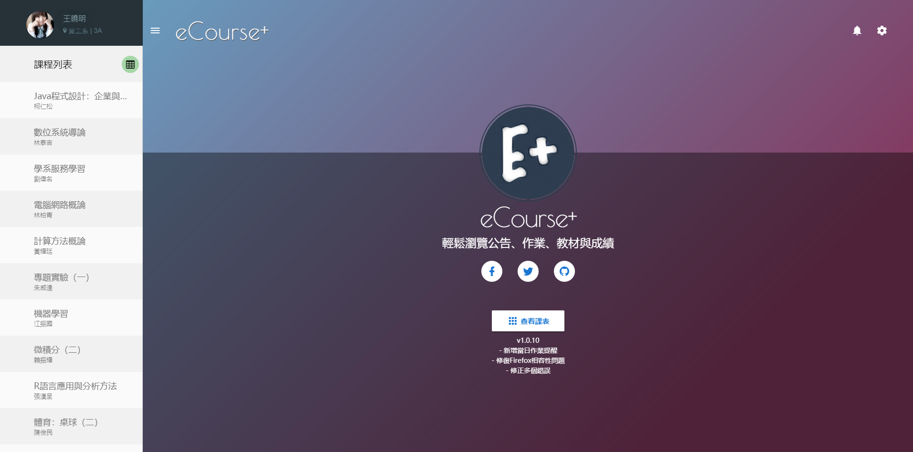
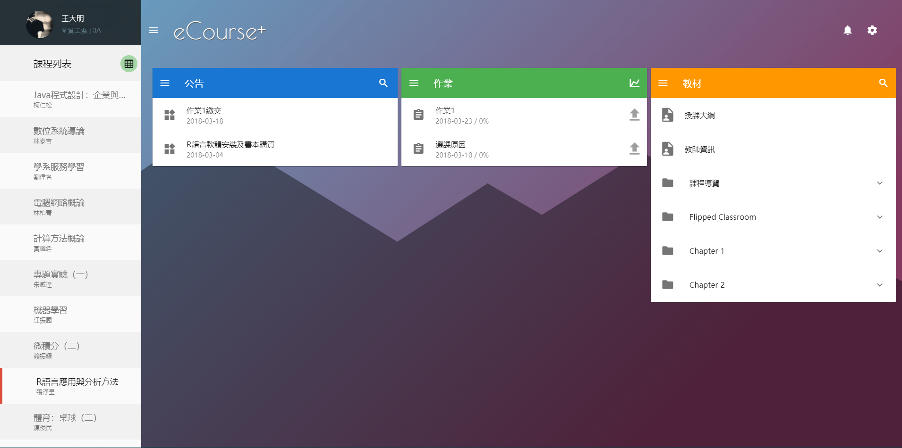
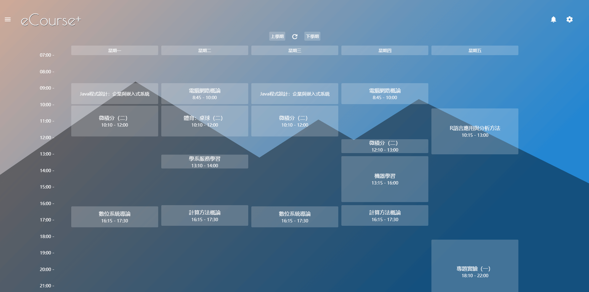

# eCourse-Plus-Plus





## 關於

這是一個純前端的服務，整合**中正大學eCourse**課程網站上的資訊，方便同學使用。

**[[網站連結]](https://ecourse.pionxzh.com/)**

## 功能

* 查看課程公告、作業、教材及成績
* 一周課表(時間/教室地點)
* 上傳作業
* 通知系統(新公告、作業)
* 作業當日提醒

## Build Setup

``` bash
# install dependencies
npm install

# serve with hot reload at localhost:8080
npm run dev

# build for production with minification
npm run build
```

